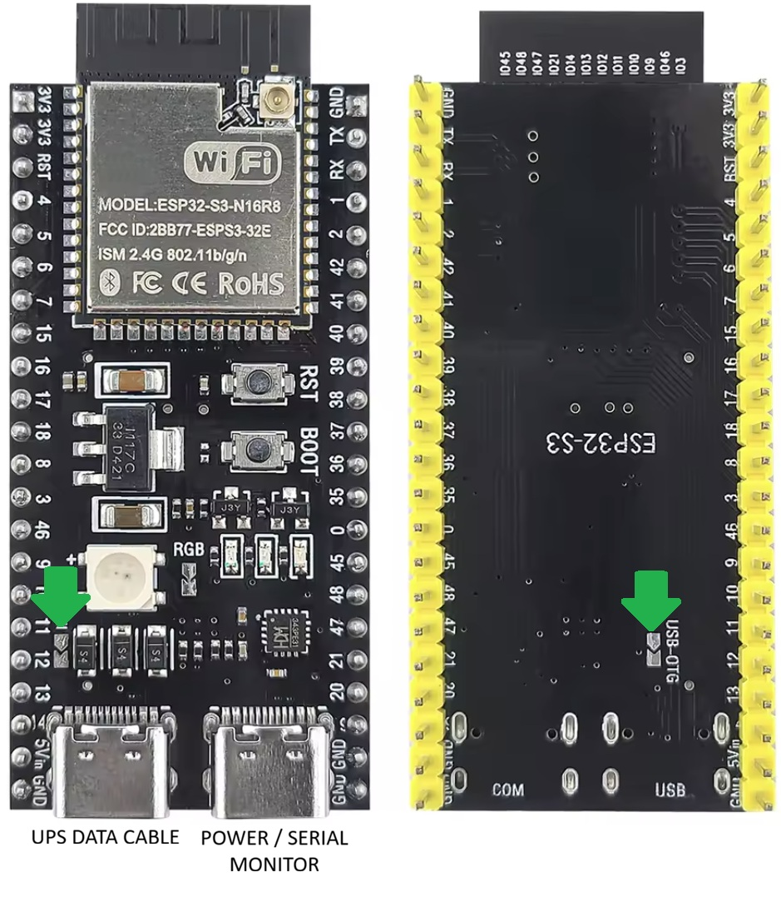
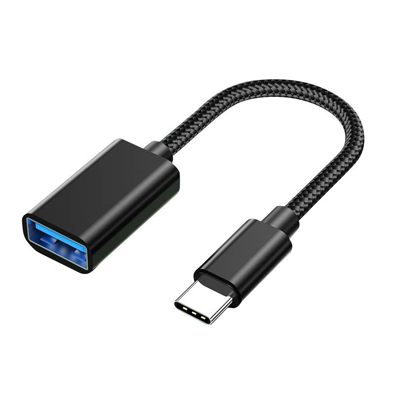
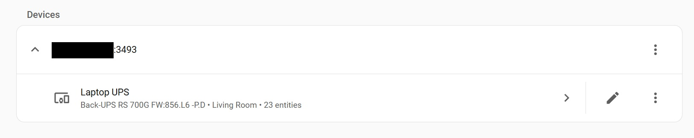

# ESP32 USB HID UPS NUT Server

An ESP32 firmware that bridges USB HID-compliant UPS devices to WiFi via the [NUT (Network UPS Tools)](https://networkupstools.org/) protocol. Plug in any standard USB HID UPS and monitor it from any NUT-compatible client - Home Assistant, upsc, NUT Monitor, etc.

I haven't tested this firmware extensively across a variety of UPS units, so don't be surprised if things are broken and/or buggy.

## Features

- **Generic HID parsing** - auto-discovers UPS capabilities from the HID report descriptor; no hardcoded UPS models
- **Multi-UPS support** - multiple (up to 4 by default) UPS devices simultaneously via a USB hub, each exposed as a separate NUT device
- **NUT protocol server** - standard TCP port 3493, compatible with any NUT client
- **WiFi captive portal** - on first boot, the ESP32 creates an AP ("ESP32 NUT Server Setup") with a web page to select and join a WiFi network; credentials are stored in flash
- **Runtime WiFi reset** - hold the BOOT button for 3 seconds at any time to erase stored credentials and re-enter the setup portal
- **RGB LED status** - green (all OK), red (UPS alert), orange (no UPS connected), white (NUT client connected)
- **Beeper control** - short press of the BOOT button toggles the UPS audible alarm

## Hardware

- **ESP32-S3** development board (USB Host capable). Probably works on the **ESP32-S2** too, but never tested.
- Any USB HID-compliant UPS (APC, CyberPower, Eaton, Tripp Lite, etc.)
- USB cable from the UPS to the ESP32 USB host port

The on-board addressable RGB LED (GPIO 48 on most ESP32-S3 DevKitC boards) is used for status indication. The BOOT button (GPIO 0) is used for WiFi reset and beeper toggle.

## Building

Requires [ESP-IDF v5.0+](https://docs.espressif.com/projects/esp-idf/en/stable/esp32s3/get-started/).

```bash
# Source the ESP-IDF environment
. /path/to/esp-idf/export.sh

# Set target (only needed once)
idf.py set-target esp32s3

# Build
idf.py build

# Flash and monitor
idf.py -p /dev/ttyUSB0 flash monitor
```

Component dependencies (`usb_host_hid`, `led_strip`) are fetched automatically by the ESP-IDF component manager on first build.

## Configuration

Build-time options are available under `NUT UPS Server Configuration` in `idf.py menuconfig`:

| Option | Default | Description |
|--------|---------|-------------|
| TCP bind port | `3493` | NUT protocol port |
| UPS name | `ups` | NUT name for the first UPS; additional units get `ups-2`, `ups-3`, etc. |
| Poll interval | `1000 ms` | How often HID reports are read from each UPS |
| LED GPIO | `48` | Addressable RGB LED data pin |
| Button GPIO | `0` | BOOT button pin for WiFi reset / beeper toggle |

## WiFi Setup

1. Power on the ESP32
2. Connect your phone/laptop to the **"ESP32 NUT Server Setup"** WiFi network
3. A captive portal page opens. If not, navigate to http://192.168.4.1 in a web browser
4. Select your WiFi network, enter the password, and click Connect
5. The ESP32 should connect to the selected network and disable the WiFi setup AP

To re-enter setup mode at any time, **hold the BOOT button for 3 seconds**. The device erases stored credentials and reboots into the portal.

## USB Connections

UPS units should be connected to the USB host port on the **ESP32-S2**/**ESP32-S3** dev board.
The serial monitor can be accessed via the USB UART port. The USB UART port can also be used to supply 5V (if your particular board supports it).

### Enabling USB OTG Power

All of the UPS models I tested needed USB 5V to be present in order to enumerate properly. On the **ESP32-S2**/**ESP32-S3** dev boards, there are often one or two sets of pads that need to be bridged in order to supply 5V over the USB host port. For example, on the cheap ESP32-S3 dev boards there are two sets of pads that need to be bridged - one on the front and one on the back:

<p align="center" width="100%">
     
</p>

### USB OTG Adapter

A USB OTG adapter such as the one pictured below will likely be needed for connecting to the UPS unit(s) using standard cables. For APC brand UPS models, it is sometimes possible to find data cables with USB-C connectors (be careful, one of the two I bought off Amazon was wired incorrectly).

<p align="center" width="100%">
     
</p>

## NUT Client Usage

Once connected to WiFi with a UPS plugged in, query the server from any machine on the same network:

```bash
# List connected UPS devices
upsc -l <esp32-ip>

# Show all variables for the default UPS
upsc ups@<esp32-ip>

# Query a specific variable
upsc ups@<esp32-ip> battery.charge

# If multiple UPS are connected
upsc ups-2@<esp32-ip>
```

### Home Assistant

Add through the usual NUT integration GUI. Attached UPS units should show up in the devices list and start polling status immediately.



## Supported NUT Variables

Variables are auto-discovered from the UPS HID descriptor. Common ones include:

| Variable | Description |
|----------|-------------|
| `ups.status` | OL (online), OB (on battery), LB (low battery), etc. |
| `ups.load` | Output load percentage |
| `ups.temperature` | Internal temperature |
| `input.voltage` | Input AC voltage |
| `output.voltage` | Output AC voltage |
| `battery.charge` | Battery charge percentage |
| `battery.runtime` | Estimated runtime in seconds |
| `battery.voltage` | Battery DC voltage |
| `device.mfr` | UPS manufacturer |
| `device.model` | UPS model name |
| `device.serial` | UPS serial number |

## Architecture

```
USB HID UPS(es)
      |
  [USB Host]
      |
  hid_ups.c      -- HID descriptor parser, report polling, NUT variable mapping
      |
  nut_server.c   -- NUT protocol TCP server (port 3493)
      |
  WiFi STA       -- connected via wifi_prov.c captive portal
      |
  NUT clients    -- upsc, Home Assistant, NUT Monitor, etc.
```

## Project Structure

```
esp-nut-rebuild/
  CMakeLists.txt          -- Top-level ESP-IDF project file
  sdkconfig.defaults      -- Default config (esp32s3, header buffer size)
  main/
    main.c                -- Entry point: init NVS, WiFi, USB, NUT server
    hid_ups.c / .h        -- USB HID UPS driver (multi-device, generic parsing)
    nut_server.c / .h     -- NUT protocol TCP server
    wifi_prov.c / .h      -- WiFi provisioning (SoftAP captive portal + NVS)
    led_status.c / .h     -- RGB LED status indicator
    Kconfig.projbuild     -- Build-time configuration options
    idf_component.yml     -- Component dependencies
```

## Disclaimer

This software is provided “as is”, without warranty of any kind, express or implied. By using this software, you acknowledge that you do so at your own risk. The author shall not be held responsible or liable for any direct, indirect, incidental, consequential, or other damages, losses, or injuries arising from its use or misuse.